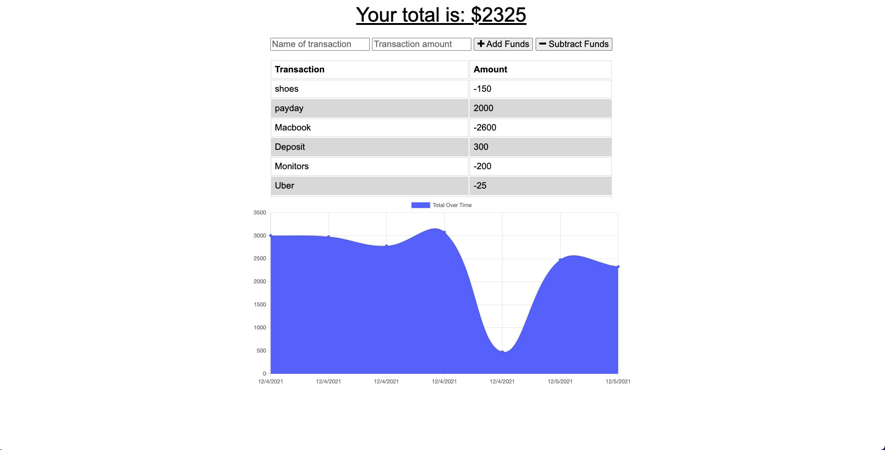

# Budget Tracker

## Description

This application is a budget tracker app that uses different technology to help keep track of your budget. The different technology that is used for this app are MongoDB, Mongoose, Express, HTML and CSS. This app is a Progressive Web Application (PWA) that can be used to test the different capabilities of the Javascript functions in modern browsers. One benefit that this application has is with the other parts that were created it will be able to work offline.

The service worker, manifest and IndexedDB help with this process. A lot of budget trackers can be used online but if they go offline they have to connect to a server to save anything. With this app, even offline, can track what budget you need. Users value the ability to use the application when they need it, compared to just when their phone or mobile device wants to work for them. 

## Table of Contents

* [Installation](#installation)
* [Usage](#usage)
* [Technologies](#technologies)
* [License](#license)
* [Links](#links)

## Installation

All you have to do is click on the deployed Heroku application link: [Heroku](https://sleepy-coast-92190.herokuapp.com/)

## Usage

To use the app, put in addition and subtractions for the different transactions. Items such as payday, and other various expenses, and then anyone can track the budget to stay on track for the day, vacation, or month that needs to be kept track of. 

## Technologies

- Node.js
- Express.js
- Mongoose
- Mongo.DB
- HTML
- CSS
- Javascript

## License

MIT License

## Links

[Heroku](https://sleepy-coast-92190.herokuapp.com/)
[Github](https://github.com/smurphy7326/budget-tracker)
